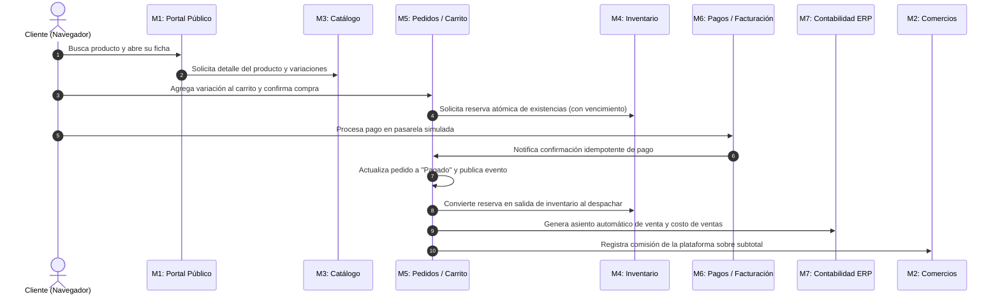

# Pacíficos Online · Plataforma de Mercado en Línea Multiempresa

> **Universidad de Costa Rica · Sedes Regionales**  
> **Carrera de Informática Empresarial · Sede de Guanacaste, Recinto de Liberia**  
> **IF6100 — Análisis y Diseño de Sistemas · II Ciclo 2026**  
> **Docente:** Lic. Iván Chavarría Cubero

---

## 1. Descripción del Proyecto

**Pacíficos Online** es una plataforma de comercio electrónico multiempresa que reúne a diversos comercios regionales en un portal centralizado. Permite que cada comercio gestione de forma autónoma su propio micrositio, catálogo e inventario manteniendo su identidad de marca, al tiempo que brinda a la clientela una experiencia de compra unificada e integra la administración de pedidos, medios de pago simulados, facturación electrónica y contabilidad ERP.

Este repositorio constituye el **código fuente único y centralizado** para los 7 subgrupos de trabajo y el Comité de Arquitectura e Integración.

---

## 2. Organización de Módulos y Subgrupos

| Subgrupo | Módulo | Alcance Funcional Clave | Dependencias |
| :--- | :--- | :--- | :--- |
| **SG1** | **M1: Portal público y búsqueda** | Página de inicio, catálogo destacado, buscador por texto/categoría, ficha de producto y micrositio. | M2, M3 |
| **SG2** | **M2: Micrositios y comercios** | Panel administrativo del comercio, aprobación/suspensión, comisiones por pedido, membrecías. | Núcleo |
| **SG3** | **M3: Catálogo de productos** | Gestión de productos, variaciones, SKU, categorías, atributos, multimedia y disponibilidad. | M2 |
| **SG4** | **M4: Inventario multiempresa** | Existencias por variación/ubicación, kardex, reserva atómica con vencimiento y alertas de mínimo. | M3 |
| **SG5** | **M5: Carrito y pedidos** | Carrito multicomercio, cálculo de impuestos/envío, estados de pedido y ciclo de vida de la compra. | M3, M4, M6 |
| **SG6** | **M6: Pagos y facturación** | Pasarela de pago simulada (Tarjeta/SINPE/PayPal), confirmación idempotente y emisión de facturas. | M5 |
| **SG7** | **M7: ERP contable y reportes** | Plan de cuentas, asientos contables automáticos (venta y costo de ventas), libro diario/mayor y reportes. | M5, M6, M2 |
| **Comité**| **Núcleo compartido** | Identidad, autenticación, RBAC, aislamiento multi-tenant por comercio (RN-12), auditoría y manejo de errores. | Todos |

---

## 3. Reglas de Convivencia Arquitectónica (Obligatorias)

Conforme a la sección 5.4 del enunciado del proyecto, el desarrollo debe regirse estrictamente por las siguientes reglas:

1. **Propiedad del dato:** Cada entidad compartida tiene un único módulo propietario. Ningún otro módulo puede crearla o modificarla directamente.
2. **Prohibición absoluta de lectura directa:** Queda terminantemente prohibido realizar `JOINs` entre tablas de diferentes módulos o importar y utilizar modelos Eloquent ajenos (`app/Models/M*` de otro subgrupo). Toda consulta intermódulo debe realizarse exclusivamente a través de la interfaz de contrato (`app/Contracts/M*`).
3. **Integridad referencial:** Se permite declarar llaves foráneas a nivel de motor de base de datos para preservar la consistencia relacional; no obstante, las lecturas asociadas se realizan por contrato.
4. **Contrato antes que código:** Todo módulo publica su contrato (`app/Contracts` y `contracts/*/openapi.yaml`) y dobles de prueba (stubs/mocks) antes de comenzar la implementación interna.
5. **Versionado de contratos:** Cualquier modificación que altere la interfaz exige una nueva versión del contrato y aprobación formal por el Comité de Arquitectura.
6. **Aislamiento por comercio (Regla RN-12):** Ningún comercio puede acceder a datos de otro comercio. La aplicación de este filtro es transversal y obligatoria en el Núcleo.

---

## 4. Recorrido Transversal de Compra (Extremo a Extremo)

El flujo transversal que valida la integración completa de los 7 módulos comprende los siguientes pasos:



---

## 5. Estructura del Repositorio

```text
pacifico-online/
├── app/
│   ├── Contracts/                   # Interfaces PHP publicadas por cada módulo
│   │   ├── M1_Portal/
│   │   ├── M2_Comercios/
│   │   ├── M3_Catalogo/
│   │   ├── M4_Inventario/
│   │   ├── M5_Pedidos/
│   │   ├── M6_Pagos/
│   │   ├── M7_Contabilidad/
│   │   └── Nucleo/
│   ├── Http/
│   │   └── Controllers/             # Controladores (capa delgada sobre contratos)
│   │       ├── M1_Portal/
│   │       ├── M2_Comercios/
│   │       ├── ...
│   │       └── Nucleo/
│   ├── Models/                      # Modelos Eloquent privados de cada módulo
│   │   ├── M1_Portal/
│   │   ├── M2_Comercios/
│   │   ├── ...
│   │   └── Nucleo/
│   ├── Services/                    # Implementación de lógica de negocio y contratos
│   │   ├── M1_Portal/
│   │   ├── ...
│   │   └── Nucleo/
│   └── Providers/
├── contracts/                        # Especificaciones OpenAPI (v1, v2...) por módulo
│   ├── m1-portal/v1/openapi.yaml
│   ├── m2-comercios/v1/openapi.yaml
│   ├── m3-catalogo/v1/openapi.yaml
│   ├── m4-inventario/v1/openapi.yaml
│   ├── m5-pedidos/v1/openapi.yaml
│   ├── m6-pagos/v1/openapi.yaml
│   └── m7-contabilidad/v1/openapi.yaml
├── database/
│   └── migrations/                  # Migraciones de BD con nombres de tabla reservados
├── docs/                            # Documentación y actas del curso
│   ├── actas-comite/                # Actas oficiales del Comité (Anexo D)
│   ├── actas-subgrupos/             # Actas de constitución y roles (Anexo A)
│   ├── adr/                         # Architecture Decision Records
│   ├── solicitudes-cambio/          # Solicitudes de cambio formal (Anexo B)
│   └── referencias.md               # Referencias bibliográficas en formato APA 7.ª ed.
├── resources/
│   └── views/                       # Vistas Blade en kebab-case
│       ├── m1-portal/
│       ├── m2-comercios/
│       ├── m3-catalogo/
│       ├── m4-inventario/
│       ├── m5-pedidos/
│       ├── m6-pagos/
│       ├── m7-contabilidad/
│       └── nucleo/
├── routes/
│   ├── modules/                     # Rutas modulares aisladas
│   │   ├── m1_portal.php
│   │   ├── m2_comercios.php
│   │   ├── ...
│   │   └── nucleo.php
│   └── web.php                      # Enrutador principal con Route::prefix()
└── tests/
    ├── Feature/                     # Pruebas funcionales y de integración
    │   ├── Contracts/               # Pruebas de verificación de contratos
    │   ├── M1_Portal/
    │   └── ...
    └── Unit/                        # Pruebas unitarias de lógica de negocio
        ├── M1_Portal/
        └── ...
```

---

## 6. Instalación y Puesta en Marcha (Estandarizado con Laragon)

Para asegurar que todo el grupo trabaje sobre el mismo entorno y evitar incompatibilidades, el desarrollo está estandarizado utilizando **Laragon** (que incluye PHP 8.3+, Composer, MySQL y Node.js).

### Paso 1: Configurar las Variables de Entorno de Laragon en Windows

Si utilizas PowerShell o VS Code externo, Windows necesita saber dónde están `php` y `composer`. Tienes dos alternativas:

#### Opción A: Configuración Permanente en PowerShell (Recomendada)
Ejecuta el siguiente comando una sola vez en PowerShell para registrar PHP y Composer en tu usuario:
```powershell
[System.Environment]::SetEnvironmentVariable('Path', [System.Environment]::GetEnvironmentVariable('Path', 'User') + ";C:\laragon\bin\php\php-8.3.33-Win32-vs16-x64;C:\laragon\bin\composer;C:\laragon\bin\git\cmd", 'User')
```
> **Nota:** Cierra y vuelve a abrir tu terminal / VS Code tras ejecutar el comando para aplicar los cambios.

#### Opción B: Usar la Terminal Integrada de Laragon
1. Abre la aplicación **Laragon**.
2. Presiona el botón **"Terminal"** (Laragon carga automáticamente todas las rutas de PHP, Composer, Git y MySQL).

#### Opción C: Configuración Temporal (Solo para la ventana actual)
```powershell
$env:Path = "C:\laragon\bin\php\php-8.3.33-Win32-vs16-x64;C:\laragon\bin\composer;" + $env:Path
```

---

### Paso 2: Clonación y Puesta en Marcha del Proyecto

Ejecuta los siguientes comandos en orden dentro de tu terminal:

1. **Clonar el repositorio:**
   ```bash
   git clone <url-del-repositorio>
   cd pacifico-online
   ```

2. **Instalar dependencias de PHP y JavaScript:**
   ```bash
   composer install
   npm install
   ```

3. **Crear el archivo de variables de entorno `.env`:**
   ```powershell
   # En Windows PowerShell o CMD:
   copy .env.example .env

   # En Git Bash / Linux / macOS:
   cp .env.example .env
   ```

4. **Generar la clave de seguridad de la aplicación (OBLIGATORIO):**
   ```bash
   php artisan key:generate
   ```
   > ⚠️ **Importante:** Si omites este paso, obtendrás el error `MissingAppKeyException: No application encryption key has been specified`.

5. **Configurar y migrar la Base de Datos:**
   * **Opción SQLite (Por defecto, lista sin configurar nada):**
     ```bash
     php artisan migrate
     ```
   * **Opción MySQL (Usando la base de datos de Laragon):**
     Inicia MySQL en Laragon (botón *Start All*), crea la base de datos `pacifico_online` y configura tu `.env`:
     ```env
     DB_CONNECTION=mysql
     DB_HOST=127.0.0.1
     DB_PORT=3306
     DB_DATABASE=pacifico_online
     DB_USERNAME=root
     DB_PASSWORD=
     ```
     Luego ejecuta:
     ```bash
     php artisan migrate --seed
     ```

6. **Iniciar el servidor local de desarrollo:**
   ```bash
   php artisan serve
   ```
   Accede en tu navegador a: `http://localhost:8000`

---

---

## 7. Ejecución de Pruebas Automatizadas

Para validar las pruebas unitarias y de integración de los módulos:

```bash
# Ejecutar todas las pruebas
php artisan test

# Ejecutar pruebas de un módulo específico (ej. M4 Inventario)
php artisan test --filter=M4_Inventario

# Ejecutar pruebas de contrato intermódulo
php artisan test --filter=Contracts
```

---

## 8. Calendario de Hitos y Puntos de Control

- **PC1 (Semana 04 - 03 SET):** Visión de la plataforma y ficha del módulo (Fase de Inicio).
- **PC2 (Semana 06 - 17 SET):** Requerimientos del módulo y modelo canónico (Fase de Elaboración 1).
- **PC3 (Semana 11 - 22 OCT):** Arquitectura, contratos y diseño del módulo (Fase de Elaboración 2).
- **PC4 (Semana 15 - 19 NOV):** Plataforma integrada y verificada (Fase de Construcción).
- **Defensa Final (Semana 16 - 25 NOV):** Demostración del recorrido transversal en vivo.
