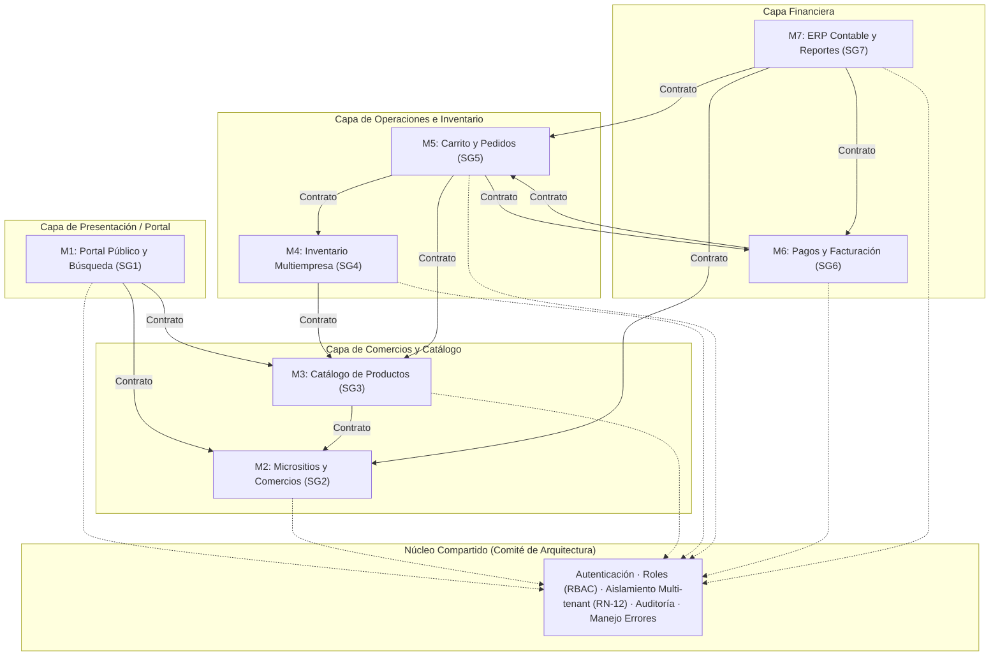
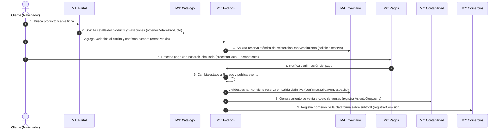

# Documento de Arquitectura de Software (DAS)
**Pacíficos Online · IF6100 Análisis y Diseño de Sistemas (II Ciclo 2026)**

---

## 1. Visión General de la Arquitectura

**Pacíficos Online** está diseñado bajo el patrón de **Monolito Modular Guiado por Contratos (Contract-Driven Modular Monolith)**.

### ¿Por qué este patrón?
- **Repositorio y Despliegue Único:** Todo el sistema reside en un único proyecto Laravel, facilitando el despliegue integrado y la verificación transversal.
- **Fronteras Estrictas entre Módulos:** Cada uno de los 7 subgrupos opera sobre su módulo de forma autónoma, sin interferir en el código interno ni en la base de datos de los demás subgrupos.
- **Desacoplamiento mediante Contratos:** La comunicación entre módulos se realiza exclusivamente mediante **Interfaces PHP** (`app/Contracts/`) y especificaciones **OpenAPI** (`contracts/`), prohibiendo el acceso directo a datos o modelos Eloquent ajenos.

---

## 2. Los Módulos del Sistema y el Núcleo Compartido



### 2.1 Módulos y Responsabilidades

1. **M1: Portal Público y Búsqueda (SG1)**
   - *Responsabilidad:* Vitrina principal de la plataforma, buscador global por texto y categorías, visualización de productos y comercios destacados, vistas de micrositios de comercios.
   - *Depende de:* `M2_Comercios`, `M3_Catalogo`.
2. **M2: Micrositios y Administración de Comercios (SG2)**
   - *Responsabilidad:* Panel administrativo de comercios, incorporación, aprobación, suspensión, configuración de micrositios, cálculo y registro de comisiones por pedido, membresías.
   - *Depende de:* `Nucleo`.
3. **M3: Catálogo de Productos (SG3)**
   - *Responsabilidad:* Gestión de productos, variaciones (atributos, color, talla), SKU, códigos de barra, categorías, marcas, imágenes y disponibilidad.
   - *Depende de:* `M2_Comercios`.
4. **M4: Inventario Multiempresa (SG4)**
   - *Responsabilidad:* Control de existencias por variación y ubicación física, kardex de movimientos, reservas atómicas temporales con vencimiento (RN-04) y alertas de inventario mínimo.
   - *Depende de:* `M3_Catalogo`.
5. **M5: Carrito y Gestión de Pedidos (SG5)**
   - *Responsabilidad:* Carrito unificado multi-comercio, cálculo de subtotales, impuestos y envíos, ciclo de vida del pedido (Pendiente -> Pagado -> En Preparación -> Despachado -> Entregado / Cancelado).
   - *Depende de:* `M3_Catalogo`, `M4_Inventario`, `M6_Pagos`.
6. **M6: Pagos y Facturación Electrónica (SG6)**
   - *Responsabilidad:* Procesamiento de pagos mediante simuladores (Tarjeta, SINPE Móvil, PayPal), confirmación idempotente de cobro, conciliación y generación de comprobante de factura electrónica (XML).
   - *Depende de:* `M5_Pedidos`.
7. **M7: ERP Contable y Reportes Gerenciales (SG7)**
   - *Responsabilidad:* Plan de cuentas contable, generación automática de asientos de venta y costo de ventas al despachar, libro diario y mayor, reportes financieros y tablero de control.
   - *Depende de:* `M5_Pedidos`, `M6_Pagos`, `M2_Comercios`.
8. **Núcleo Compartido (Comité de Arquitectura e Integración)**
   - *Responsabilidad:* Infraestructura transversal. Seguridad, autenticación de usuarios, roles y permisos, filtro obligatorio de aislamiento de datos por comercio (**Regla RN-12**), bitácora central de auditoría y estandarización del manejo de excepciones.

---

## 3. Reglas de Convivencia Arquitectónica (Sección 5.4 del Enunciado)

Estas reglas son de **cumplimiento obligatorio** y son evaluadas estrictamente en los puntos de control PC3, PC4 y Defensa Final:

| Regla | Descripción | Penalización por Incumplimiento |
| :--- | :--- | :--- |
| **Propiedad del Dato** | Cada tabla de base de datos pertenece a un solo módulo. Solo ese módulo puede insertar, modificar o eliminar sus registros. | Pérdida de puntaje en fidelidad al diseño. |
| **Prohibición de Lectura Directa** | **CERO `JOINs`** entre tablas de módulos distintos y **CERO importaciones de modelos Eloquent ajenos**. Toda consulta intermódulo se realiza mediante el contrato PHP (`app/Contracts/M*`). | **Fallo crítico** en la evaluación de arquitectura. |
| **Integridad Referencial** | Las migraciones pueden declarar llaves foráneas (`foreignId`) hacia tablas de otros módulos para que el motor SQL mantenga la integridad relacional, pero la lectura en código se hace por contrato. | - |
| **Contrato Antes que Código** | El subgrupo publica su contrato PHP y OpenAPI antes de programar la lógica interna, permitiendo que los consumidores avancen con dobles de prueba (Mocks). | Atraso no justificado en caso de bloqueo. |
| **Versionado de Contratos** | Si un módulo necesita modificar parámetros o respuestas de una operación existente, debe publicar una versión nueva (ej. `v2`) y mantener convivencia sin romper consumidores vigentes. | Incompatibilidad en integración. |
| **Aislamiento Multi-tenant (RN-12)** | Ningún comercio puede acceder a la información de otro comercio. Se implementa en el Núcleo mediante Scopes Globales de Eloquent. | Vulnerabilidad crítica en rúbrica. |

---

## 4. Recorrido Transversal de Compra (9 Pasos de Integración)

Este es el flujo de extremo a extremo evaluado en vivo durante la **Defensa Final**:



---

## 5. Decisiones Técnicas Transversales y Mitigación de Riesgos

### 5.1 Concurrencia de Existencias (Regla RN-04)
- **Problema:** Dos clientes compran la última unidad disponible al mismo instante.
- **Solución Arquitectónica:** El módulo `M4_Inventario` utiliza transacciones de base de datos con **bloqueo pesimista** (`DB::transaction` con `lockForUpdate()`) al ejecutar `solicitarReserva()`. La reserva genera un identificador con tiempo de expiración (TTL de 15 minutos). Si la existencia es 0, la operación falla de manera atómica y M5 informa al cliente que el producto se agotó.

### 5.2 Aislamiento por Comercio (Regla RN-12)
- **Problema:** Un comercio malicioso o un error en consulta expone ventas o inventario de otro comercio.
- **Solución Arquitectónica:** Los modelos Eloquent de módulos multi-tenant (`M2`, `M3`, `M4`, `M5`, `M7`) aplican un **Global Scope** provisto por el `Nucleo`, que inyecta automáticamente la cláusula `WHERE comercio_id = ?` según la sesión activa.

### 5.3 Idempotencia en Pagos (M6)
- **Problema:** La pasarela de pago o el cliente reenvía la notificación de pago múltiples veces por problemas de red.
- **Solución Arquitectónica:** `M6_Pagos` genera y almacena una clave única de idempotencia (`idempotency_key` o `transaccion_id`). Si se recibe la misma transacción, retorna el resultado previo sin crear pedidos duplicados ni duplicar asientos en M7.

---

## 6. Estructura de Capas dentro de Cada Módulo

Cada módulo sigue una arquitectura en capas limpia dentro de Laravel:

```text
┌────────────────────────────────────────────────────────┐
│                   Rutas (routes/modules/)              │
└───────────────────────────┬────────────────────────────┘
                            │
┌───────────────────────────▼────────────────────────────┐
│         Controladores (app/Http/Controllers/M*)        │  <-- Capa delgada: Valida input, llama al Servicio
└───────────────────────────┬────────────────────────────┘
                            │
┌───────────────────────────▼────────────────────────────┐
│            Contratos (app/Contracts/M*)                │  <-- Interfaz PHP pública del módulo
└───────────────────────────┬────────────────────────────┘
                            │
┌───────────────────────────▼────────────────────────────┐
│            Servicios (app/Services/M*)                 │  <-- Lógica de negocio y orquestación
└───────────────────────────┬────────────────────────────┘
                            │
┌───────────────────────────▼────────────────────────────┐
│             Modelos (app/Models/M*)                    │  <-- Eloquent ORM privado del módulo
└───────────────────────────┬────────────────────────────┘
                            │
┌───────────────────────────▼────────────────────────────┐
│         Base de Datos (database/migrations/)           │  <-- Tablas reservadas del módulo
└────────────────────────────────────────────────────────┘
```
